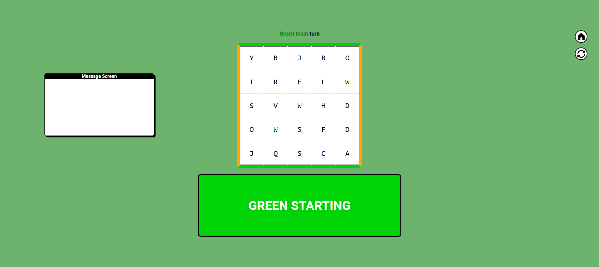

# LettersWar - Web Trivia Game + Admin dashboard

LettersWar is a web trivia game where two teams Orange and Green fight over a 5x5 board to capture a one path from the start to the end of their side.

# HOW TO WIN :

To win there are two cases normal win where either the orange capture a path from left to right or green from top to bottom.
in case of draw where no team captured a path , the team that captured the most cells wins.
